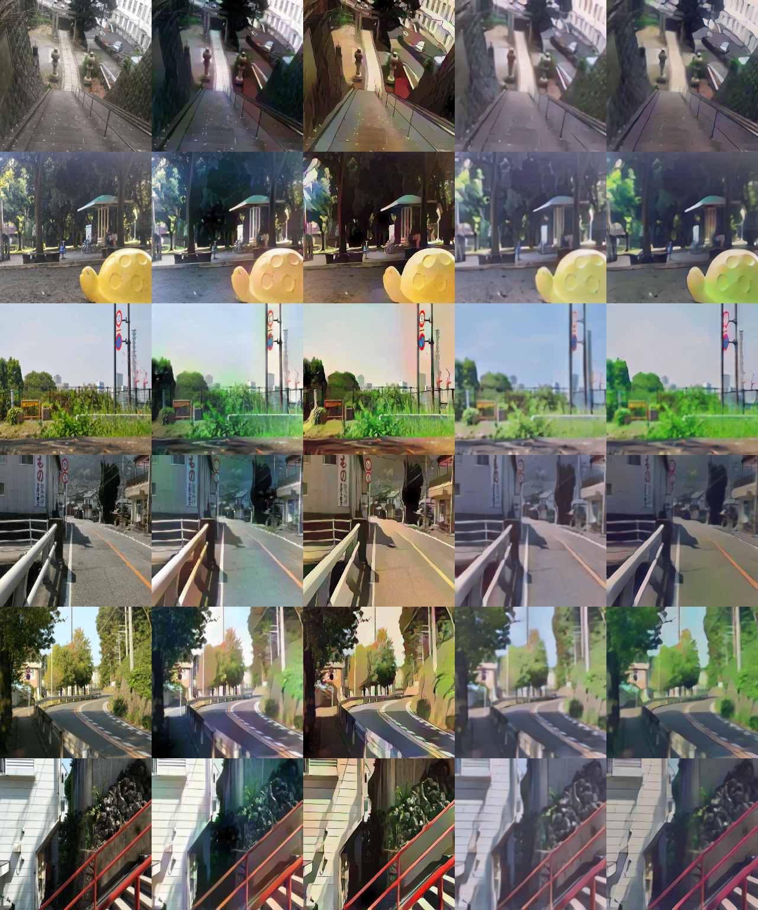

# Anime-stylization
Pytorch implementation of CartoonGAN [1](CVPR 2018) and further imporve this algorithm.
 * 3 new loss functions.
 * Use WGan instead of the origin Gan.
 

## Usage
### 1.Download VGG19 and prepare for the dataset
[VGG19](https://download.pytorch.org/models/vgg19-dcbb9e9d.pth)

for the dataset, you need the unpaired cartoon images and the real photos. 
### 2.Train cartoonGan version
```
python cartoongan.py
```
Adjust the parameters in config.py
### 3.Train our version
```
python animeganv2.py
```
Adjust the parameters in configv2.py

### 4.Eval
You can eval the model with eval.py, and use vedio2anime.py to transfer the vedio to anime. See the python file for details. 


## Results
### Our results
compared with cartoon gan

real photo...............shinkai ...............  hayao....................  our shinkai ........... our hayao  

here is the vedio demo:


There is three Scenes in total. The original video,  Shinkai, Hayao style appear one after another.

you can watch the full vedio at the following http links:
<table align='center'>
<tr align='center'>
<td> Input - Result (this repo) </td>
<td> Author's pre-trained model (Hayao) </td>
<td> Author's pre-trained model (Hosoda) </td>
</tr>
<tr>
<td><a href="https://disk.pku.edu.cn:443/link/8AB1CBDD05EE1F1266DD72D335E6CB1A">原视频 Origin vedio</a>
<td><a href="https://disk.pku.edu.cn:443/link/3F308FB375E7A30A6A3CDAE996FC1E29">宫崎骏风格 Hayao</a>
<td><a href="https://disk.pku.edu.cn:443/link/BD922C3ED46AAFAEAAEC53552A74B806">新海诚风格 Shinkai</a>
</tr>
</table> -->

<!-- ### Cartoonization
* I got the author's results from [CaroonGAN-Test-Pytorch-Torch](https://github.com/Yijunmaverick/CartoonGAN-Test-Pytorch-Torch).
<table align='center'>
<tr align='center'>
<td> Input - Result (this repo) </td>
<td> Author's pre-trained model (Hayao) </td>
<td> Author's pre-trained model (Hosoda) </td>
</tr>
<tr>
<td>
<td>
<td>
</tr>
<tr>
<td>
<td>
<td>
</tr>
<tr>
<td>
<td>
<td>
</tr>
<tr>
<td>
<td>
<td>
</tr>
<tr>
<td>
<td>
<td>
</tr>
</table> -->

## Development Environment

* NVIDIA RTX 3080
* cuda 11.2
* python 3.7
* pytorch 1.8
* torchvision 0.6.0
* opencv 4.2.0

## Reference
[1] Chen, Yang, Yu-Kun Lai, and Yong-Jin Liu. "CartoonGAN: Generative Adversarial Networks for Photo Cartoonization." Proceedings of the IEEE Conference on Computer Vision and Pattern Recognition. 2018.

(Full paper: http://openaccess.thecvf.com/content_cvpr_2018/papers/Chen_CartoonGAN_Generative_Adversarial_CVPR_2018_paper.pdf)
